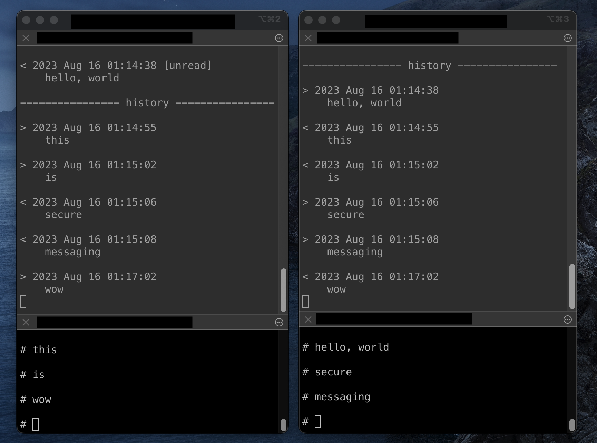

# Secure Messaging



## Required:

- openssl: 1.1.1
- mysql: 8.0

## How to build:

### server side

1. install openssl: 
    ```
    sudo apt install libssl1.1
    sudo apt install libssl-dev
    ```

2. install mysql: 
    ```
    sudo apt install mysql-server
    sudo apt install libmysqlclient21
    sudo apt install libmysqlclient-dev
    ```

3. log in to mysql and create a database named secure_messaging_db: 
    ```
    create database secure_messaging_db;
    ```

4. modify ./include/protocol.h: 
    ```
    #define SERVER_IP                   "xxx"     <-
    #define DATABASE_USER               "xxx"     <-
    #define DATABASE_PASSWORD           "xxx"     <-
    ```

5. `make`

### client side

1. install openssl: 
    ```
    sudo apt install libssl1.1
    sudo apt install libssl-dev
    ```

2. install mysql: 
    ```
    sudo apt install libmysqlclient-dev
    ```

3. modify ./include/protocol.h: 
    ```
    #define SERVER_IP                   "xxx"     <-
    ```

4. `make`
